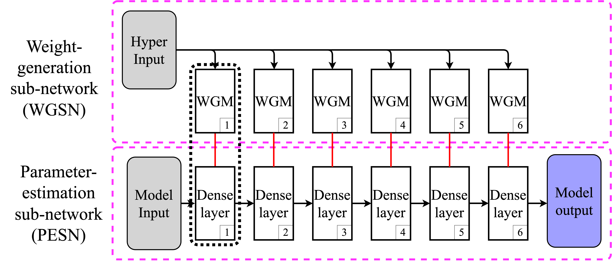

Pressure estimation using conditional neural network (CondNN)

# 1. Description 

This project provides a neural network model for the estimation of wind pressure distribution over building surfaces. 

The model has two inputs, i.e., the wind condition vector and the coordinate vector. The wind condition vector has 6 elements [width, depth, height, roof slope, incidence wind angle, side number]. The second input is the normalized coordinate vector, which is the actual coordinates divided by corresponding building dimensions. That is normalized x is the actual x divided by building width, normalized y is the actual y divided by building depth, and normalized z is the actual z divided by building height.

The model output is the pressure statistics at the normalized coordinate. The pressure statistics include the mean, standard deviation, skewness, and kurtosis. Please choose the corresponding model to achieve the target output statistics. For the convenience of usage, the single parameter int_case is defined. The necessary parameters are defined based on int_case. 

## 1.1 Cases
* int_case 1: Used 12 models. Output mean.
* int_case 2: Used 12 models. Output standard deviation.
* int_case 3: Used 12 models. Output skewness.
* int_case 4: Used 12 models. Output kurtosis.
* int_case 5: Used 96 models. Output mean.

## 1.2 Model information 
The neural network model is built based on the newly proposed Conditional Neural Network, where the weight of a neural network is generated by another neural network. 

## 1.2 Training data
The model is trained with Tokyo Polytechnic University (TPU) low-rise building wind tunnel test data.

# 2 Environment
To run these pre-trained models, you need to install the following packages:
- Python
- PyTorch
- Numpy
- ipython
- ipykernel
- matplotlib

## 2.1 Run the code
Open the jupyter notebook. Set up the case number.

## 2.2 Abbreviations | Naming convention

OS[1-4]: Output Statistics 
    OS1: mean
    OS2: standard deviation
    OS3: skewness
    OS4: kurtosis

UM[12,96]: Used wind tunnel Model number
    UM12: 12 models were used
    UM96: 96 models were used

## 2.3 Data
The data is stored in the data folder. The wind_tunnel folder stores the TPU wind tunnel data used for training. The original data was stored in TPU_LR folder. The original data was organized for training process and cached in TPU_LR_cache folder. The neural network models 

## 2.4 Other data
This model is trained using the TPU low-rise building wind tunnel testing data. Considering the good quality of TPU wind tunnel test database, it this model is expected to work on other data with lower accuracy. The user just needs to provide he wind condition vector and the coordinate vector.

To increase the accuracy, transfer learning is needed. Specifically, to use other wind tunnel data, these data should be organized in the same format as the TPU data. 

